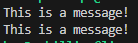

# ASP assignment

## Makefile

To make compiling and running my programs easier I created a Makefile. I have used automatic variables so all the .cpp files that are used will automatically be converted to object files.

```Makefile
%.o: %.cpp
	$(CXX) $(CXXFLAGS) -c $^
```

I also have a 'file' variable for when make is being used so I don't have to extend or change the Makefile every time I want to compile using a new file. When using make you can pass a file name in using the 'file' variable and it will compile it with the needed files and create an executable called 'main'. When passing in a file name you should omit the extension name part, so for example 'file1.cpp' would be passed in as 'file1'. Below is what it would it would look like using the 'schedule_test.cpp' file from task 2.


If you don't specify a file then there will be an error message and an executable will not be created.


I have a seperate rule in the Makefile for my unit tests. To create an executable for these you can use 'make test' and it will create a 'test' executable.


## Task 1

For this task I first implemented an example that shows how context works. You can find this example in the 'context_test.cpp' file. This program will initialise x to 0, then use the get_context function to save the state to return to later, then x will be checked to see if it is 0. If it is then it will be incremeted and the set_context function will be called and the state saved with get_context earlier will be returned to. Below you can see the output of the program.



<br/>

Next I implemented an example that demonstrates using 'fibers'. This is done using functions 'foo' and 'goo' to act as the fibers and using set_context to switch between them. You can find the example of this in the 'control_test1.cpp' file. Each fiber also has it's own stack.

From main I created a context and set the stack pointer to the stack of the fiber it is in and the instruction pointer to the fiber we want to switch to when set_context is called. 

Here the context is being switched to 'foo'.

```c++
// allocate stack space
char *data = new char[4096];
char *sp = data + 4096;
// align to 16 bytes
sp = (char*)((uintptr_t)sp & -16L);
// account for red zone
sp -= 128;

Context c;
c.rsp = sp;

// set context instruction pointer to foo and switch
c.rip = (void*)foo;
set_context(&c);
```

Then in 'foo' the same proccess will happen, it will have it's own stack and context and from there control will be switched to 'goo'.

There is no way to return so I exited from goo using 'exit(1)'. Below is the output from this.


<br/>

I also created a different example that uses swap_context instead of set context. You can find this in the file 'control_test2.cpp'. In foo a second context is created. The get_context function is used with the second context and there is a conditional that will cause the context to be set back twice. After the second time it will not run and swap_context will be called to swap this will the first context that has its instruction pointer get to goo. This will then move the control to goo.

```c++
Context c;
c.rsp = sp;
c.rip = (void*)goo;

Context s;

volatile int i = 0;

get_context(&s);

if (i < 2) {
    cout << "foo run " << i+1 << endl;
    i++;
    set_context(&s);
}

swap_context(&s, &c);
```

Here is the ouput of the program.


# Task 2

For this example I created a fiber class. You can find this in 'fiber.hpp' and 'fiber.cpp'. This class takes has 3 variables, context, stack_top and stack_bottom. On creation the class must take a void* function as a parameter. A stack and context will be created and the contexts stack pointer and instruction pointer will be set to the stack and the void* function respectively. The class also has a public method to return the context.

I then reworked the original example from task 1 to use this class. You can find the reworked version in the file 'control_rework.cpp'.

```c++
fiber f((void*)foo);
Context c = f.get_context();
set_context(&c);
```

<br/>

I then created a scheduler class to manage running multiple fibers. You can find this implementation in the 'scheduler.hpp' and 'scheduler.cpp' files. This class has 2 variables, 'fibers' which is a queue of fibers to run, and 'context' which is used to move around the control in the shceduler. It also has 3 methods; 'spawn' which takes a pointer to a fiber as a parameter and pushes the fiber to the back of the queue, 'do_it' which will begin running the fibers in the queue until it is empty, and 'fiber_exit' which must be used at the end of a fiber to exit it and pass control back to the scheduler.

After creating the class I made a program to test the scheduler. This can be found in the file 'scheduler_test1.cpp'. This example creates 2 fibers, calls spawn using the scheduler to put them in the queue and then calls do_it to run them. Both these fibers just print and call fiber_exit.


The scheduler is made global so it can be accessed from any fiber that is running.

<br/>

I created another example called 'scheduler_test2.cpp' to demonstrate creating and spawning another fiber during the first fiber than is ran. 

```c++
cout << "fiber 1 running" << endl;
fiber f((void*)func3);
s.spawn(&f);
s.fiber_exit();
```

This should put the new fiber at the end of the queue.


<br/>

Then I added an optional pointer to my fiber class for data that may want to be passed in and a 'get_data' method for accessing it. I also added a 'cur_fiber' variable to my scheduler class which is the current fiber that is running and a 'get_data' method that will return the data from the current fiber thats running.

After that I created an example in the file 'scheduler_data_test1.cpp' that runs two fibers that share a pointer to the same data. So changing the data in one of the fibers changes it for any other fibers using it too.


<br/>

I created a second example to demonstate the data sharing between fibers. This is in the file 'scheduler_data_test2.cpp'. This example uses 3 fibers. Only the first fiber will be spawned and then do_it will be called. Fibers 1 and 3 will get and increment the data and all fibers will spawn the next fiber, so they are called in a loop.

```c++
int *dp = (int*)s.get_data();
cout << "fiber 1: " << *dp << endl;
*dp = *dp += 1;
fiber f((void*)func2, dp);
s.spawn(&f);
s.fiber_exit();
```

In the second fiber there is a conditional that another fiber will only be spawned if the value in the data if less than 15. So these fibers will spawn each other in a loop until the value reaches 15.

```c++
if (*dp < 15) {
    fiber f((void*)func3, dp);
    s.spawn(&f);
}
```


## Task 3

For this task I implemented yield for the scheduler class. This implemetation is similar to the context_test program from task 1. I added a new method called 'change_context' to my fiber class to make this work. This takes a context as a paramter and replaces the current context with it. 

```c++
void fiber::change_context(Context c)
{
    context_ = c;
}
```

In the yield function in the scheduler class we have two contexts, one to call get_context with so we can return here later, and another to save the original context that the fiber was created with so we can change it back when it returns here. There is also a yielded variable that is used to check wether in not it has already been yielded before. This is important as otherwise we will end up with the fiber infinitely looping. When yielded the fiber will be pushed to the back of the queue to allow other fibers to run, then will return here and complete when it reaches the front of the queue.

```c++
bool yielded = false;
// create new context to return to later and another one to store the fibers current context to give back
Context return_context, original_context;
get_context(&return_context);

// check yield status we don't create an infinite loop
if (!yielded) {
    yielded = true;

    // keep current context to give back later
    original_context = cur_fiber_->get_context();
    // replace the context of the fiber with the new context so we can return later
    cur_fiber_->change_context(return_context);

    // push this fiber to the back of the queue
    fibers_.push_back(cur_fiber_);
    cur_fiber_ = nullptr;

    // jump back to scheduler
    set_context(&context_);
}

yielded = false;
// change context back to original
cur_fiber_->change_context(original_context);
```

<br/>

Then I developed a simple example using the yield function to test it. You can find this example in 'yield_test1.cpp'. This example just uses two fibers and the first one yields to allow the second to run and then the first one is returned to. The output of the program is below.


<br/>

Then I created another example using yield in 'yield_test2.cpp'. Yielding a fiber should push it to back of the queue. I created and spawned a fiber inside the first fiber before yield is called to test this. So the created fiber should run before this fiber is returned to.

```c++
void func1()
{
    cout << "fiber 1 before yield" << endl;
    fiber f((void*)func3);
    s.spawn(&f);
    s.yield();
    cout << "fiber 1 after yield" << endl;
    s.fiber_exit();
}
```

This gave the expected result.


I then extended this to spawn another fiber after yield was called. So now the order should be f1 before yield -> f2 -> f3 -> f1 after yield -> f3.


<br/>

I then implemented an example of using yield and sharing data between fibers. You can find this example in 'yield_data_test1.cpp'. In this example there is two fibers that share data. The first fiber will print the data before and after yield.

```c++
cout << "fiber 1 before yield" << endl;
int *dp = (int*)s.get_data();
cout << "data is " << *dp << endl;
s.yield();
cout << "fiber 1 after yield" << endl;
dp = (int*)s.get_data();
cout << "data is " << *dp << endl;
s.fiber_exit();
```

The second fiber will change the data after the first fiber has called yield so the first fiber should print different values.


<br/>

I made another example of using yield and data sharing called 'yield_data_test2.cpp'. This has 4 fibers that perform different tasks and will all share the same data. The fiber 'loop' will initally be spawned. In this fiber it will check if the value of the data is less than 5 and if it is then it will spawn another fiber 'fib' to be added to the end of the queue and yield. When it returns, it will spawn the fiber 'print' which prints the value of the data.

```c++
if (*dp < 5) {
    fiber f((void*)fib, dp);
    s.spawn(&f);

    s.yield();

    fiber pr((void*)print, dp);
    s.spawn(&pr);
}
```

In the 'fib' fiber it will spawn the 'inc' fiber, which increments the data by one, and yields. When it returns the 'loop' fiber will be spawned.

```c++
fiber incr((void*)inc, dp);
s.spawn(&incr);

s.yield();

fiber lp((void*)loop, dp);
s.spawn(&lp);
```

This will generate a loop so if the initial data value is set to 0 it should print out 1 to 5. Below you can see the output.

